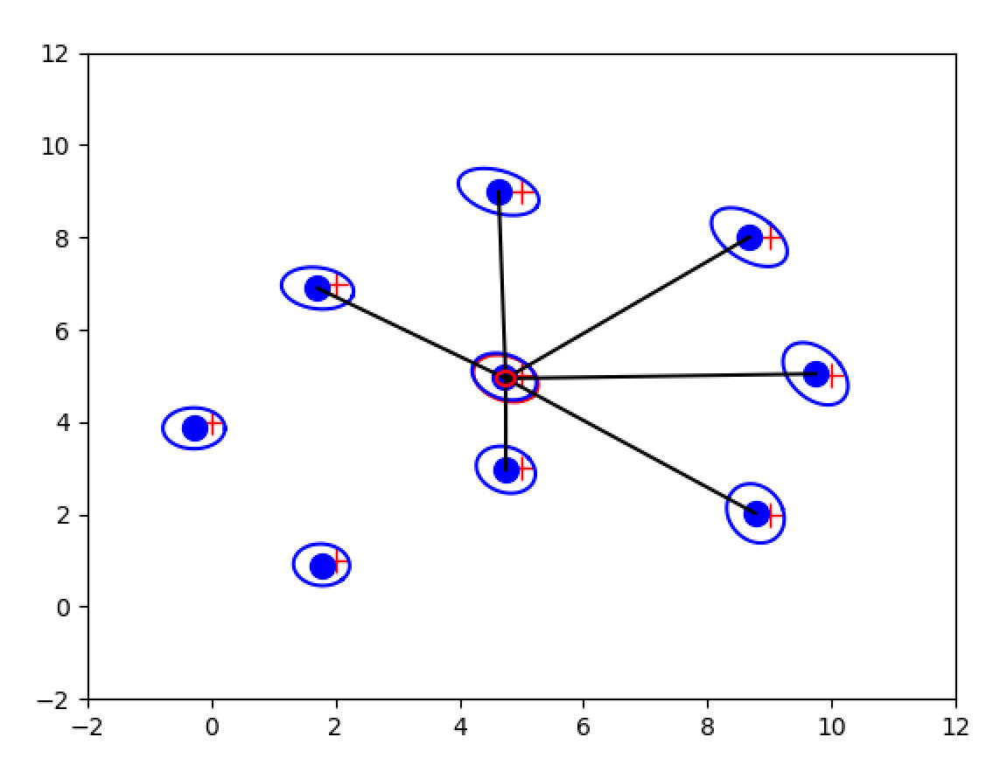

# Project A2: EKF-SLAM

Due Date: November 18, 2022

In this lab, you will implement the Extended Kalman Filter Algorithm for a 2-D SLAM simulation in C++. You will also have known data associations (i.e. you will have the corresponding measurements at each time step for each landmark). You must work in a group of 2 for this assignment.

## Environment Setup
You can choose to do this lab locally or on the server. The assignment asks to visualize and plot the final graphs which requires X11 forwarding. X11 forwarding can be OS dependant, so if you work locally you would need to find out how to acomplish this. To develop locally, please download docker for your OS.

The required dependancies you will need for this program are:
- Python2.7
- Numpy
- Matplotlib

### Docker Image

There is a partially complete Dockerfile provided in `docker/Dockerfile`, which uses a base `python2.7` image. 
You must complete the Dockerfile and install the required dependancies yourself.

### X11 forwarding & Docker Container

Since the outcome of this lab is a visualization through (python wrapped) matplotlib library, you will need to setup X11 forwarding.

#### Ubuntu (our server)
To create your container on Ubuntu, you would need to add these additional flags:

```
-v /tmp/.X11-unix:/tmp/.X11-unix \
-v ~/.Xauthority:/root/.Xauthority \
-e DISPLAY=$DISPLAY --net=host
```

#### Mac
For MacOS users, to do X11 forwarding in docker you would have to install xQuartz and then run:

```
xhost + 127.0.0.1
```
Then, when creating your container you can add the following flag:

```
-e DISPLAY==host.docker.internal:0
```

#### Docker Container additional information
X11 forwarding Instructions depend on your OS.
***Note:*** Since the base image is python2.7, you will need to add a further command to your `docker run` command to run it a interactive bash session. You must find out what this command is. 

## Project Structure
Your project consists of three folders, a `data` folder,an `include` folder, and a `src` folder. The `data` folder contains all the sensor and world data information for the simulation. The `include` folder includes all public headers necessary for the project. Lightweight implementations can go here, hence our filereaders will be coded directly in the headers. The `src` folder is where the majority of your programming will happen. This is the directory that contains the actual implementations for the interfaces you defined in the headers. You also store private headers in this folder.
For this project, you are only allowed to modify the following files:

- include/mapper.h
- include/sensor_info.h
- include/plotter.h
- src/main.cpp
- src/ekfslam.h

Additionally you should create your own `.cpp` file for the ekfslam implementation. All other files will be replaced with fresh ones for testing so please do not make changes to them. Your executable ***must*** read the `sensor.dat` and `world.dat` files through CLI interface.

## Phase 1: Makefile
You need to complete the given Makefile in order to compile your code. It should consist of two rules. First rule: you should build the project and produce an executable called `EKFSLAM`. In order to compile this project, you will need to link the `python2.7` library. To link, you may also have to provide the path to the library using the `-I` flag. You also must compile with `-Wall` and `-Werror`. Second rule: you should be a standard clean command that removes an intermediate executables. Your Makefile should output all executables into a directory called `bin`. You will be provided with a skeleton Makefile that you must properly fill out according to these specifications.

## Phase 2: Reading in Sensor and Map Information

You need to efficiently read and store the information present int `world.dat` and `sensor.dat`. Since this is rudimentry, you should test this phase yourself if your file readers and storing is correct.

### `World.dat` Structure
The world.dat file contains the ground truth information for all the simulated landmarks. Let us look at the first few entries of `world.dat`:
```
1 2 1
2 0 4
```
These are the first two entries in the world.dat file. The first entry in each row is the landmark ID. The last two entries represent the groundtruth (x,y) coordinate of the landmark.

### Reading in Map information
The map information in `world.dat` consists of the locations of all simulated landmarks. The `mapper.h` file is where you will implement a class to read in data about the world. You must complete the `Mapper` class. You should create a member function which takes in the `world.dat` file and reads the information appropriately. You should read in the x,y values as type `float`.

### `Sensor.dat` Structure
There are two possible types of data in `sensor.dat`. The first is an odometry reading, and the other a sensor reading. At every time step there will be one piece of odometry data, and potentially multiple sensor readings. As an example,
```
ODOMETRY 0.100692392654 0.100072845247 0.000171392857486
SENSOR 1 1.89645381418 0.374031885671
SENSOR 2 3.85367751107 1.51951017943
```
For the odometry reading, the first entry represents the first rotation, the second entry represents the first translation and the last entry represents the second translation. This odometry information represents the ***control input for a given time step.***

For each sensor reading the first entry represents the landmark ID, the second entry represents the range of the observed landmark, and the last entry represents the angle relative to the car. For instance, `SENSOR 1` means the robot observed landmark 1, and from above example has range 1.89645381418. This is how you can keep track of each landmark without associating them at every step. These sensor data are ***all recorded measurements for the observed landmarks from a laser scanner for a given time step.***

### Reading in Sensor Information
You must read the sensor readings from the file `sensor.dat`. The file consists of two types of sensor readings, `ODOMETRY` and `SENSOR`. There are two a structs in the file `sensor_info.h` called `OdoReading` and `LaserReading`. You will need to devise a way to represent a 'Record', which is all the sensor observations at ***one time step*** (you can call this structure a `Record`). In this file there is also a class called `MeasurementPackage`. You must complete the class. You must have a way to read `sensor.dat` and store all the measurements for each time step i.e. all Records. You should devise a way to store the information efficiently to have access to all the sensor information throughout the rest of the project.

## Phase 3: Implementing the EKF
You have been provided with an `ekfslam.h` file that exists within the `src` directory. This header file defines all the necessary matrices that need to be tracked. At this point, we will start using the Eigen Library in order to do all the matrix operations necessary to implement the EKF-SLAM algorithm. Refer to [this](https://eigen.tuxfamily.org/dox/group__TutorialMatrixClass.html) tutorial from the official Eigen website to become more familiar with the library. There are three main functions that need to be implemented for the `EKFSLAM` class. The constructor to initialize the mean and covariance matrices/vectors, the prediction step, and the correction step. We use a class here, as all the variables for the class will be self-contained within it. A key thing to note, is that we have the known data associations between time steps for each landmarks. These are tracked by the landmark IDs. So you will not need to do any data association for the lab. Note: In lab hours, the TA will discuss more thorough Prediction and Correction step implementation details.

### Constructor
In order to add noise to the model, we define a noise motion constant in the constructor. It us up to you as the programmer to both make the proper size for the noise matrix Q, as well as add the noise due to motion.

### Prediction
For the prediction step, you must use odometry data. For the odometry information, you will use the `MeasurementPackage` class, specifically the `OdoReading` data from Phase 2. The predict step should take in the control input for one time step.

### Correction
In the correction step, you will use the class `MeasurementPackage` and specifically all laser observations (`laserReading`) for a given time step in order to update the mean and covariances for your EKF. One thing to note is that observed landmarks is a vector of booleans. This represents the IDs of the observed landmarks. This is how we can guarantee that this lab has known data associations for observed landmarks. Note: for angles, you would need to normalize it to be between –pi and pi. 

### Calibrating the Noise Matrices
One very important thing to remember about the Kalman Filter is that it is a tunable algorithm. One of the main parameters that needs to be tuned is the modeling of the noise matrices Q and R. This is something that you will have to play with in order to find a good answer. As part of this lab, you should try and find the optimal values to model the sensor noise and motion noise. It is very typical for these two values to be something you can't just find. You have to go through the work of calibrating your filter to find the optimal noise for each of your noise and observation models. It is recommended to tune these parameters fully once your entire code works so you can visualize the effect of the noise matricies.

## Phase 4: Main file
This is the last step when coding the SLAM algorithm, but you need to combine everything and run it in one singular main file. You must loop through all available sensor data you must plot the estimates of each state at every time step. Your main file must take in two and only two arguments, the filepath to the sensor data and world data. Additionally, if the user does not input any files or an incorrect number of arguments the program should print usage instructions and terminate appropriately. If you make your main file properly, you should see a plot that evolves for each update step. The basic structure of main is:

- Read in the sensor data
- Read in the world data
- Instantiate a EKFSLAM object
- Instantiate a Draw object for visualization
- Go through all measurements and apply EKF-SLAM

## Phase 5: Visualizing the Simulation
To visualize your simulation, you need to plot the landmarks, the robot’s position, and then the estimated states of the robot’s position as well as the estimations of the position of each landmark. You are given the Draw class inside `include/plotter.h` to help you with visualization. Specifically, you may find functions `Plot_State()`, `Clear()`, `Pause()`, and `Show()` helpful. To get `Plot_State()` to work, you must complete the function `DrawLandMarks()`.
If you can not get X11 forwarding working, it is recommend to save images of the plots by calling `Save()`. If you have done everything correctly, you should see a plot that evolves for
each update step. The final step should look like the figure below:



## Evaluation

### Grade Breakdown

- Program Correctness: 75%
- Makefile & Dockerfile: 5%
- Style, Comments, & Implementation: 10%
- Interactive grading: 10%

Avoid collaboratation or sharing code with other teams. To avoid consequences, please do not violate this.
***All work must be your own***, your program files will go through MOSS (Measure of Software Similarity) plagiarism checker. 

### Program Correctness

There is a reference executable provided (`ref/EKFSLAM_kartik`). You should be able to run it to view a working example. You are expected to reproduce the same visualization through ekf-slam algorithm. Note: your gaussians may look slightly different depending on your code and noise tuning.

### Style, Comments & Implementation

Your code needs to be commented and styled.
It is recommended to follow the [Google C++ Style Guide](https://google.github.io/styleguide/cppguide.html). You can download a linter in order to ensure your code follows style. In terms of commenting, please make sure that each function you have has well-defined inputs and outputs. Each function should have a comment with
the following.
- A description of what the function is doing
- Its Inputs
- Its Outputs (if necessary)

It is also recommend commenting on code you feel is too verbose or confusing. If there is a piece of code that you have written and the TA's can not understand what you are doing then it is safe to say it needs a comment. 

As well as being readable, you will be graded on your implementation. You should follow the [C++ Coding Standards and Best Practices](https://web.mit.edu/6.s096/www/standards.html).

### Interactive Grading
Since this is a group assignment, there will be interactive grading for this project. This is just to verify that all members understand the code fully. Hence, this will be individual -- to make sure you succeed, make sure you understand all of your submitted code, even if there are parts you did not code yourself.

## Submission

Similar to previous labs, your submission will be done by directly pushing code to your private repository. Please do not modify any source files you are not allowed to (see Project Structure section). 

Commits up to a week late will incur a -10% late penalty.

## Credits
Teja Aluru, Kolin Guo, Wenda Xu, Jeff Lai, Kartik Patwari, and Chen-Nee Chuah
